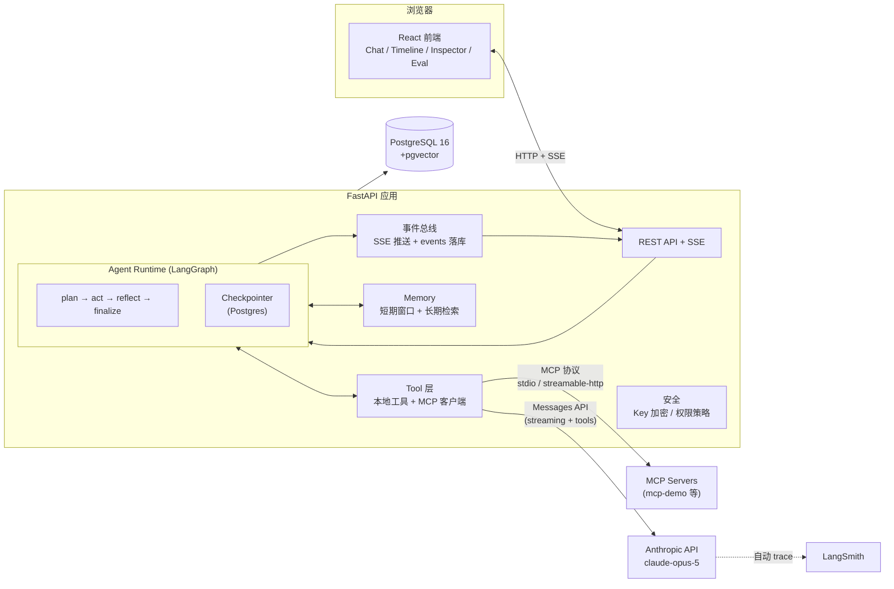
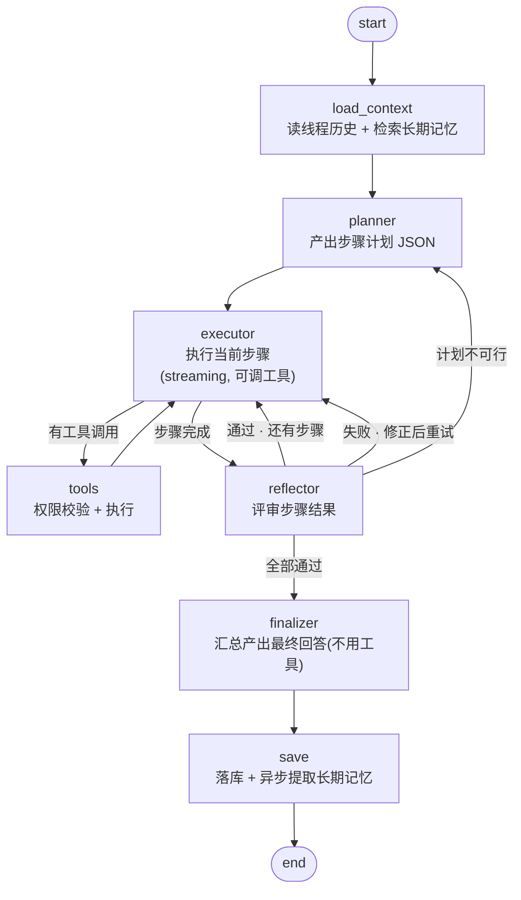
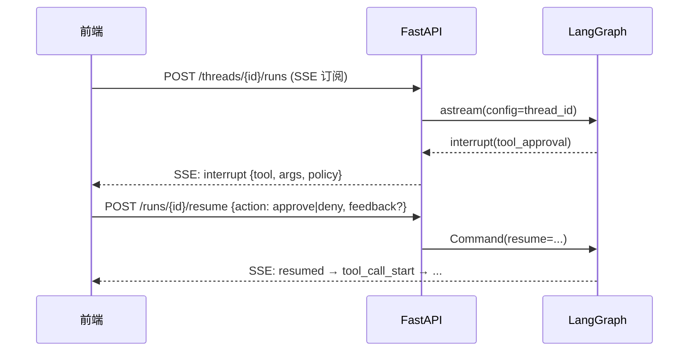
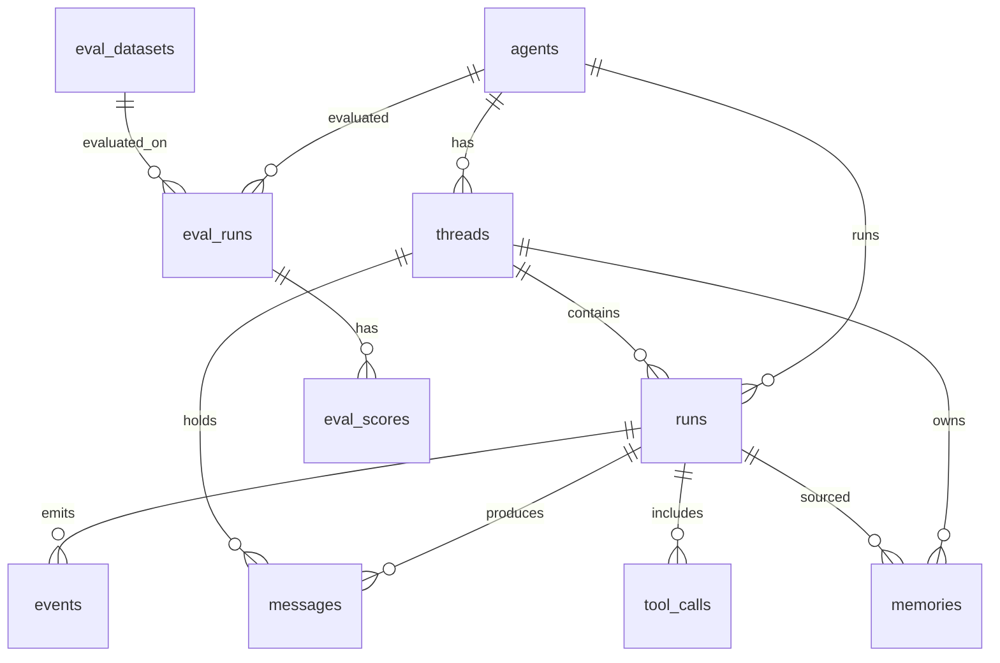

# MCP Agent Platform — 开发框架（v1）

> 状态：已评审、已交付（M0–M8，2026-08-20）。实现偏差见 §16。
> 本文档定义 v1 的架构、选型、模块设计、数据模型、API 契约与开发计划。
> 全新项目：不修改、不依赖任何已有 Agent 项目（如 SSK-agent、ai-project）的代码。

---

## 1. 目标、范围与需求映射

### 1.1 v1 目标

**单 Agent + MCP + Planning + Memory + Evaluation + Observability** 的生产级基础架构。Agent 运行时可插拔工具、可持久化恢复、可审批干预、可评估回归、全程可观测。

### 1.2 v1 明确不做（Non-Goals）

| 不做 | 原因 |
|---|---|
| Multi-Agent / 子 Agent 编排 | v2 议题 |
| 复杂 RAG（文档解析、分块策略、重排） | 长期记忆只做语义检索，不做文档库 |
| 写文件 / 删除文件 / 执行任意代码等高危工具 | v1 工具面只读优先 |
| RBAC / 多租户 / 计费 | 平台内部工具，v1 单管理员 |
| Kubernetes、横向扩容 | Docker Compose 足够 |
| 自研 Agent DSL / 可视化编排 | 不必要的复杂度 |

### 1.3 29 项需求 → 设计章节 / 里程碑映射

| # | 需求 | 设计章节 | 里程碑 |
|---|---|---|---|
| 1 | LLM 调用 | §5.1 | M1 |
| 2 | Tool Calling | §5.2 | M1 |
| 3 | MCP Tool 调用 | §5.2 | M2 |
| 4 | Agent Loop | §5.3 | M1 |
| 5 | 任务规划 Planning | §5.4 | M4 |
| 6 | State 状态管理 | §5.5 | M1 / M3 |
| 7 | Checkpoint 持久化 | §5.5 | M3 |
| 8 | Short-term Memory | §5.6 | M3 |
| 9 | Long-term Memory | §5.6 | M3 |
| 10 | Tool 执行结果管理 | §5.8 | M2 |
| 11 | Reflection / Self-Correction | §5.7 | M4 |
| 12 | Evaluation | §11.3 | M7 |
| 13 | LangSmith Tracing | §5.10 | M1 起 |
| 14 | 前端实时 Streaming | §7.2 / §8 | M1 / M6 |
| 15 | Agent Timeline 可视化 | §8.4 | M6 |
| 16 | State Inspector | §8.4 | M6 |
| 17 | Tool Call 可视化 | §8.4 | M6 |
| 18 | Memory 可视化 | §8.4 | M6 |
| 19 | Evaluation Dashboard | §8.5 | M7 |
| 20 | Tool Permission | §5.9 | M5 |
| 21 | Human-in-the-loop | §5.9 | M5 |
| 22 | Retry / Timeout / Error Handling | §5.1.3 / §5.3.4 | M1（贯穿） |
| 23 | API Key 安全管理 | §9 | M5 |
| 24 | PostgreSQL 持久化 | §6 | M0 |
| 25 | Docker 部署 | §10 | M0 |
| 26 | 单元测试 | §11.1 | 贯穿 |
| 27 | 集成测试 | §11.2 | M3+ |
| 28 | Agent Evaluation Dataset | §11.3 | M7 |
| 29 | API 文档 | §7（FastAPI 自动生成 `/docs`） | M0 起 |

---

## 2. 技术选型

| 层 | 选型 | 理由 | 备选（为何不选） |
|---|---|---|---|
| 后端语言 | Python 3.12 | LangGraph / MCP SDK / LangSmith 的 Python 生态最完整 | TypeScript：checkpoint/HITL/MCP 适配生态弱，自研量大 |
| Web 框架 | FastAPI + uvicorn | async 原生、OpenAPI 自动文档、SSE 支持好 | Django：过重 |
| Agent 运行时 | **LangGraph**（`langgraph` + `langgraph-checkpoint-postgres`） | 自带 Postgres Checkpoint、`interrupt()` HITL、多模式 streaming、LangSmith 自动 trace——这几项正是本平台的核心需求，自研是重复造轮子 | 自研 loop：需重造 checkpoint/resume/流式，复杂度翻倍且更难维护 |
| LLM | Anthropic **Claude Opus 5**（`claude-opus-5`），每节点可配其他模型 | 当前最强 Agent 模型（1M 上下文、adaptive thinking、effort 控制） | 其他厂商：v1 单一 provider，接口抽象预留扩展 |
| LLM 集成 | `langchain-anthropic`（构建于 LangGraph 之上，统一消息模型 + LangSmith 埋点） | 与 LangGraph 工具绑定、结构化输出、追踪一体化 | 裸 `anthropic` SDK：需自做消息转换与 trace 集成 |
| MCP | 官方 `mcp` SDK + `langchain-mcp-adapters`（0.3.x） | 多服务器管理、stdio/streamable-http 传输、工具前缀命名空间、拦截器 | 自研适配层：无必要 |
| 数据库 | **PostgreSQL 16 + pgvector**（单库） | Checkpoint、业务、事件、记忆、评估五类数据一体；语义检索用 pgvector 即可，v1 不引入 Redis/独立向量库 | Redis（无必要）、Milvus/Qdrant（过度设计） |
| ORM / 迁移 | SQLAlchemy 2.0 (async) + Alembic | 生态标准 | — |
| Embedding | 默认本地 `sentence-transformers`（all-MiniLM-L6-v2, 384d），接口可插拔 | 零额外 API 依赖；量级小，本地足够 | Voyage/OpenAI：作为可配置选项保留 |
| 前端 | React 18 + TypeScript + Vite + Tailwind + Recharts | SSE 流式渲染、图表、组件生态成熟 | Vue 3：团队选 React |
| 流式协议 | **SSE**（`sse-starlette`） | Agent→前端是单向事件流，SSE 最简；双向需求（HITL 决策）用 REST 补齐 | WebSocket：双向复杂度无收益 |
| Tracing | **LangSmith + 自建事件表双轨** | LangSmith 给开发调试全链路 trace；自建事件表是产品级 Timeline 的数据源（实时 SSE + 持久化 + 离线可用） | 只用 LangSmith：前端无法实时消费、依赖外部服务 |
| 部署 | Docker Compose（4 服务） | 见 §10 | k8s：v1 过度设计 |
| 测试 | pytest + `ScriptedLLM`（脚本化假 LLM，确定性驱动）+ docker compose 集成环境 | 单元/集成确定性可断言 | 全用真实 LLM：慢、贵、不可复现 |

---

## 3. 总体架构



**一次运行（run）的完整生命周期：**

1. 前端 `POST /api/threads/{id}/runs`（SSE 订阅）
2. API 创建 `runs` 记录 → 以 `thread_id` 为 config 启动 LangGraph `astream`
3. `load_context`：读线程历史（checkpoint）+ 检索长期记忆 → 注入
4. `planner` 产出步骤计划 → `plan_created` 事件
5. `executor`（LLM streaming）逐步骤行动，可发起工具调用 → `llm_delta` / `tool_call_start` 事件
6. `tools` 节点：权限策略校验（`ask` → `interrupt()` 挂起 → 前端弹窗 → `resume` API 继续）；执行本地/MCP 工具 → `tool_call_end`
7. `reflector` 评审步骤结果：通过 / 修正重试 / 重新规划 → `reflect` 事件
8. `finalizer` 产出最终回答 → `save` 落库（messages / tool_calls / events）→ `run_end`
9. 异步任务：提取长期记忆写入 pgvector
10. 全程：事件同时进 SSE（实时）与 `events` 表（持久化，供 Timeline 回放）；LangSmith 记录完整 trace（含每节点、每工具、每 LLM 调用的 token 用量）

---

## 4. 仓库结构

```
AI-fullagent/
├── backend/
│   ├── app/
│   │   ├── main.py                 # FastAPI 入口、生命周期（checkpointer.setup、MCP 会话池）
│   │   ├── core/                   # 配置(pydantic-settings)、错误码、日志(structlog)
│   │   ├── api/                    # 路由：agents / threads / runs / tools / mcp / memory / keys / eval
│   │   ├── llm/                    # LLMProvider 抽象、AnthropicProvider、ScriptedLLM
│   │   ├── agent/                  # graph.py（拓扑）、state.py、节点：planner/executor/tools/reflector/finalizer/load/save
│   │   ├── tools/                  # registry、本地工具、mcp_client.py、executor.py（结果规范化）、policy.py
│   │   ├── memory/                 # window.py（短期）、extractor.py（提取）、retriever.py（检索）、embedder.py
│   │   ├── events/                 # 事件模型、bus.py、sse.py
│   │   ├── eval/                   # dataset.py、runner.py、judge.py、metrics.py
│   │   ├── db/                     # models.py、session.py、migrations/（alembic）
│   │   └── security/               # keys.py（Fernet）、masking.py
│   ├── tests/
│   │   ├── unit/                   # 纯逻辑：policy、memory、truncation、events、guardrails
│   │   ├── integration/            # 真实 PG + 真实 MCP demo + ScriptedLLM 端到端
│   │   └── datasets/seed_v1.json  # 评估种子数据集（≥20 条）
│   ├── pyproject.toml
│   └── Dockerfile
├── frontend/
│   ├── src/
│   │   ├── pages/                  # Chat / AgentConfig / McpServers / ApiKeys / Eval / RunDetail
│   │   ├── components/             # StreamingMessage / ToolCallCard / PlanPanel / PermissionDialog /
│   │   │                           # Timeline / StateInspector / MemoryList / EvalDashboard
│   │   ├── hooks/                  # useSSE（事件流 reducer + 断线重连）
│   │   ├── api/                    # fetch 封装、类型（与后端事件 schema 对齐）
│   │   └── App.tsx
│   ├── package.json
│   └── Dockerfile
├── mcp-demo/                       # 演示 MCP server（Node + @modelcontextprotocol/sdk：math/time/echo，只读）
├── scripts/                        # dev 启动脚本、生成 Fernet 密钥等
├── docker-compose.yml
├── .env.example
├── .github/workflows/ci.yml        # lint + unit + integration + eval 回归
└── docs/
    └── development-framework.md    # 本文档
```

---

## 5. 核心模块设计

### 5.1 LLM 调用层（需求 1、22）

**接口（薄抽象，仅两个方法，刻意不做多 provider 全家桶）：**

```python
class LLMProvider(Protocol):
    async def chat_stream(self, messages, tools, *, model, effort, max_tokens,
                          session_approvals) -> AsyncIterator[LLMEvent]:
        """executor 用：流式输出。事件类型: text_delta | tool_use | usage"""

    async def chat_once(self, messages, *, model, effort,
                        response_format: type[BaseModel]) -> LLMResponse:
        """planner/reflector/judge/记忆提取用：结构化输出，走 output_config.format"""
```

**实现与要点：**

- `AnthropicProvider`：基于 `langchain-anthropic`，默认模型 `claude-opus-5`；**每节点可单独配置模型与 effort**（planner / executor / reflector / finalizer / memory_extractor / judge，默认全部 `claude-opus-5`，`effort` 默认 executor=`high`、其余=`medium`）。模型常量集中在 `core/config.py`，便于一处切换。
- **Thinking**：全部使用 adaptive thinking（`thinking: {type: "adaptive"}`，Opus 5 默认开启）；executor 流式时 `display: "summarized"`，保证前端能看到思考摘要而非长时间停顿。
- **结构化输出**：planner 的计划 JSON、reflector 的评审 JSON、judge 的评分 JSON 一律用 `output_config.format` 约束（当前模型不支持 prefill，结构化输出是唯一正确姿势）。
- **Streaming**：executor 一律流式；长输出场景（finalizer）同样流式，避免 HTTP 超时。
- **Refusal 处理**：检测 `stop_reason == "refusal"`，启用服务端 fallback（`betas: ["server-side-fallback-2026-07-01"]` + `fallbacks: "default"`），产生明确 `error` 事件而非静默空响应。
- **Prompt 缓存**：渲染顺序固定 `tools → system → messages`，system prompt 稳定段放 `cache_control` 断点之前；通过 `usage.cache_read_input_tokens` 验证命中。
- **用量记账**：每次调用的 `usage` 写入 `events`（llm_end）与 `runs` 汇总，评估与前端成本面板直接读库。
- **ScriptedLLM**（测试专用）：按队列脚本返回预设文本/工具调用，并记录每次调用的完整请求（messages/tools/model），使 planner/executor/reflector 的 prompt 内容可精确断言。**这是测试策略的基石（§11）。**

#### 5.1.1 重试 / 超时 / 错误策略（需求 22）

| 场景 | 处理 |
|---|---|
| 429 / 5xx / 网络抖动 | 依赖 SDK 内置重试（默认 2 次、指数退避）；仍失败 → run 级 `error` 事件（`retryable: true`） |
| 401 / 403 | 立即失败，`error` 事件提示检查 API Key（不重试） |
| 单次 LLM 调用超时 | 默认 180s（流式）；超时 → 该步骤失败 → reflector 裁决 |
| 上下文超限 | 触发短期记忆窗口截断 + 生成摘要，重试一次（§5.6.1） |
| 工具执行异常 | 包装为 `is_error` 的 ToolMessage 回喂 LLM 让其自行修正；不中断 run |
| MCP server 失联 | 该 server 的工具本次运行隐藏 + `warning` 事件，run 继续 |
| run 预算耗尽 | 优雅收尾：跳过剩余步骤进入 finalizer，产出"部分完成"答案 + `notice` 事件 |

### 5.2 Tool 层与 MCP（需求 2、3、10）

**Tool Registry**：统一本地工具与 MCP 工具的注册表。每个工具带元数据：`name`（MCP 工具带 server 前缀）、`server`（`local` / MCP server 名）、`render_hint`（json/markdown/table，前端渲染用）、`policy`（§5.9）。

**v1 内置本地工具（刻意最小集）：**

| 工具 | 说明 |
|---|---|
| `calculator` | 安全四则运算（AST 解析，禁 eval） |
| `get_current_time` | 时区感知时间 |
| `remember_memory` / `forget_memory` | Agent 主动写/删长期记忆（§5.6.2） |

其余能力全部通过 MCP 接入——这正是平台的核心价值：**Agent 的工具面由 MCP 服务器动态构成**。

**MCP 客户端封装（`tools/mcp_client.py`）：**

- 基于 `langchain-mcp-adapters` 的 `MultiServerMCPClient`，服务器配置来自 `mcp_servers` 表：
  - `stdio`：本地子进程（`command` + `args` + `env`）
  - `streamable_http`：远程（`url` + `headers`，token 加密存储于配置，不落明文）
- `tool_name_prefix=True`：按 server 命名空间隔离，同名工具不冲突，前端可按 server 分组展示
- `tool_interceptors`：统一注入超时、重试、参数脱敏（API key / 密码字段打码）
- 连接生命周期：应用启动建立会话池；server 失联 → 健康标记 → 工具自动隐藏 + warning 事件
- 工具集变更：`GET /api/mcp-servers/{id}/test` 返回该 server 当前导出的工具清单供预览

**演示 server（`mcp-demo/`）**：Node + 官方 `@modelcontextprotocol/sdk`，提供 `math_add` / `math_multiply` / `get_time` / `echo` 四个只读工具，作为集成测试与 demo 的标准工具面。

### 5.3 Agent Loop（需求 4）

**State 定义（`agent/state.py`）：**

```python
class Step(BaseModel):
    id: str
    goal: str                      # 步骤目标
    status: Literal["pending","in_progress","done","failed","skipped"]
    attempts: int = 0
    feedback: list[str] = []       # reflector 的修正意见

class AgentState(TypedDict):
    messages: Annotated[list[AnyMessage], add_messages]  # 会话消息（含 tool 消息）
    plan: list[Step] | None
    current_step_index: int
    memory_context: str            # 长期记忆注入（§5.6）
    reflection_log: list[dict]     # 反思记录（前端可视化数据源）
    iteration_count: int           # 护栏计数器
    tool_approvals: dict[str, str] # 会话级工具授权缓存（§5.9）
    final_answer: str | None
```

**图拓扑（`agent/graph.py`）：**



**节点职责：**

| 节点 | 职责 | 产出 |
|---|---|---|
| `load_context` | 读 checkpoint 恢复历史；检索长期记忆 | `memory_context` |
| `planner` | 结构化输出步骤计划（§5.4） | `plan` |
| `executor` | 流式执行当前步骤，自主决定工具调用；步骤完成信号：文本中输出 `[STEP_DONE]` 或一轮无工具调用 | 消息、工具调用 |
| `tools` | 权限校验（可 `interrupt`）→ 并行执行工具 → 结果规范化回喂 | ToolMessage |
| `reflector` | 结构化输出评审：`pass / retry(feedback) / replan / abort`（§5.7） | 状态流转 |
| `finalizer` | 基于全部步骤结果生成最终回答，不调用工具 | `final_answer` |
| `save` | 落库消息/tool_calls/事件汇总；触发异步记忆提取 | — |

**护栏（默认值，per-agent 可配）：** `max_plan_steps=8`、`max_attempts_per_step=3`、`max_total_tool_calls=30`、`max_llm_calls=40`、`run_timeout=600s`。任一超限 → 优雅收尾进入 finalizer（§5.1.1）。

**取消**：`POST /api/runs/{id}/cancel` → 取消 LangGraph 任务，落 `run_end(status=cancelled)`。

### 5.4 Planning（需求 5）

**planner 契约**（结构化输出，`output_config.format` 约束）：

```json
{
  "plan": [
    {"id": "s1", "goal": "检索用户的历史偏好", "tools_hint": ["remember_memory"]},
    {"id": "s2", "goal": "……", "tools_hint": []}
  ],
  "rationale": "一句话说明策略"
}
```

- `rationale` 展示在计划面板，帮助用户理解 agent 意图（也是 HITL 信任的基础）
- 步骤状态机：`pending → in_progress → done / failed / skipped`，流转全部发事件（`step_start/step_done/step_failed`），Timeline 与计划面板共用
- 简单任务允许 planner 输出单步骤——**Planner-Executor-Reflector 图天然可退化为 ReAct**，不为简单问题付出计划开销（planner 可判定"无需计划"）

### 5.5 State 与 Checkpoint（需求 6、7）

- **Checkpointer**：`AsyncPostgresSaver`（`langgraph-checkpoint-postgres` ≥3.0，psycopg3），启动时 `setup()` 自动建表/迁移
- **线程模型**：`thread_id = threads.id`。每个 run 是一个 superstep 序列；任意节点后都可从 checkpoint 恢复
- **恢复能力**：
  - 服务崩溃/重启 → 线程状态无损（消息、计划、授权缓存都在 checkpoint 里）
  - `interrupt()` 挂起 → `resume` API 用 `Command(resume=...)` 继续（§5.9）
- **State Inspector 数据源**：每个节点结束后发 `state_snapshot` 事件（脱敏后的 state JSON，剔除 API key 等敏感字段），前端按节点展示快照 + 相邻节点 diff（§8.4）
- **安全**：设置 `LANGGRAPH_STRICT_MSGPACK=true`，防 checkpoint 反序列化注入
- **Windows 开发注意**：psycopg async 在 Windows 需 `asyncio.WindowsSelectorEventLoopPolicy()`；生产（Linux 容器）无此问题

### 5.6 Memory（需求 8、9）

#### 5.6.1 短期记忆（对话窗口）

- 即 `state.messages`，默认窗口 20 条消息
- 超窗触发：用一次 LLM 调用把最早的消息压缩成一条摘要消息（保留工具调用结果的结论性事实）
- 窗口与摘要都在 checkpoint 内，线程恢复后短期记忆完整

#### 5.6.2 长期记忆（Postgres + pgvector）

```
写入链路：run 结束 → 异步提取（LLM 结构化输出：facts/preferences 条目 + importance）
         → 文本规范化去重（同义 upsert）→ embedding（默认本地 sentence-transformers）→ memories 表
读取链路：load_context 节点 → 当前输入 embedding → top-k=8 相似检索 → 拼装 memory_context 注入 planner
Agent 主动写：remember_memory / forget_memory 工具（可被权限策略管控）
```

- 每条记忆带 `source_run_id` 溯源——Memory 面板可跳回当时的运行（需求 18）
- 记忆支持编辑/删除（API + 前端），修正错误记忆
- 检索结果按 importance × 相似度排序；importance 用于后续淘汰（v1 不做自动遗忘）

### 5.7 Reflection / Self-Correction（需求 11）

**reflector 契约**（结构化输出）：

```json
{
  "verdict": "pass | retry | replan | abort",
  "feedback": "失败时的具体修正意见（给 executor）",
  "reason": "一句话评审依据"
}
```

- `retry`：executor 带 feedback 重试本步骤（≤ `max_attempts_per_step`）
- `replan`：新信息表明原计划不可行 → 回到 planner
- `abort`：任务无法完成 → finalizer 输出部分结果 + 明确说明未完成
- 评审依据：步骤 goal vs 实际产出的证据（工具结果、文本）
- `reflection_log` 记录每次评审 → 前端可看"自我纠错轨迹"；评估指标 `reflection_fix_rate` 直接衡量其有效性（§11.3）

### 5.8 Tool 执行结果管理（需求 10）

- **落库**：每次调用写 `tool_calls` 表（args / result / status / duration_ms / error / server）
- **规范化**：结果统一为 `{ok, data, error}` 结构；MCP 异常、超时统一映射为 `ok=false` 的 ToolMessage（`is_error`）回喂 LLM
- **截断**：结果 >100KB 截断存摘要 + `truncated` 标记；回喂 LLM 前文本截断至 20KB 预算——防上下文膨胀
- **脱敏**：拦截器对疑似密钥字段（`*key*`、`*token*`、`*secret*`、`*password*`）打码后才落库和回喂
- **渲染**：`render_hint` 决定前端渲染方式（JSON 树 / markdown / 表格），MCP 工具按返回类型自动推断

### 5.9 Tool Permission 与 Human-in-the-loop（需求 20、21）

**权限模型**：每个 agent 一份 `tool_policy`（JSONB）：

```json
{
  "rules": [
    {"tool": "calculator", "action": "allow"},
    {"tool": "mcp-demo.*",  "action": "allow"},
    {"tool": "remember_memory", "action": "ask"},
    {"tool": "forget_memory", "action": "deny"}
  ],
  "default": "ask"
}
```

- `deny`：工具不出现在 LLM 的工具列表里（不是执行时才拒绝——**隐藏优于拦截**）
- `ask`：执行前 `interrupt()` 挂起，请求人工审批
- 会话级授权：用户选择"本次会话允许"→ 写入 `state.tool_approvals`（随 checkpoint 持久化），后续调用不再打扰

**HITL 时序：**



- 权限校验在 **graph 内部服务端执行**，前端弹窗只是交互层，绕过前端无法越权
- `deny` 的结果作为普通 ToolMessage 回喂 LLM（"用户拒绝了此操作，请换方案"），agent 可自行改道——这是比直接报错更完整的 HITL

### 5.10 Observability（需求 13、14）

**双轨设计（本平台的观察性核心决策）：**

| 轨道 | LangSmith | 自建事件表 + SSE |
|---|---|---|
| 用途 | 开发调试：完整 trace、每节点耗时/token、prompt 回放 | 产品功能：实时 Timeline、State Inspector、Memory 溯源 |
| 消费方 | LangSmith 控制台 | 前端 SSE 实时 + `events` 表回放 |
| 可用性 | 可关闭（平台功能不受影响） | 平台内建，始终可用 |

**事件总线（`events/bus.py`）**：所有节点/工具/LLM 动作发事件 → 扇出（SSE 推送 + DB 批量落库）。DB 落库失败不影响流式（日志 + 重试队列）。

**事件契约（`events` 表 + SSE 共用 schema）：**

```json
{"seq": 42, "ts": "2026-08-20T10:00:00Z", "run_id": "…", "type": "…", "payload": {…}}
```

事件类型：`run_start | plan_created | step_start | step_done | step_failed | llm_start | llm_delta | llm_end | tool_call_start | tool_call_end | reflect | state_snapshot | interrupt | resumed | memory_write | notice | error | run_end`

**LangSmith 集成**：`LANGCHAIN_TRACING_V2=true` + 项目名 `agent-platform`；每次 run 的 trace metadata 注入 `{thread_id, run_id, agent_id}`；前端 run 详情页提供"在 LangSmith 打开"链接。LangGraph 节点/tool/LLM 调用自动成为 trace 子树。

**日志**：structlog JSON 输出到 stdout（docker logs 友好），事件总线之外的第二排查通道。

---

## 6. 数据模型（PostgreSQL，需求 24）



| 表 | 关键字段 | 说明 |
|---|---|---|
| `agents` | id, name, system_prompt, planner_prompt, node_models JSONB, budgets JSONB, `tool_policy` JSONB | Agent 配置（模型/预算/权限） |
| `threads` | id, agent_id, title, status, created_at | 会话（LangGraph thread） |
| `runs` | id, thread_id, agent_id, status, input, final_answer, usage JSONB, latency_ms, error | 一次"用户输入→最终回答" |
| `messages` | id, thread_id, run_id, role, content, tool_calls JSONB, token_usage, seq | 前端会话渲染 + 评估数据源 |
| `tool_calls` | id, run_id, tool_name, server, args JSONB, result JSONB, status, duration_ms, error, truncated | 工具执行结果管理（§5.8） |
| `events` | id, run_id, seq, type, payload JSONB, ts | Timeline 数据源；索引 `(run_id, seq)` |
| `memories` | id, thread_id?, type, content, embedding vector(384), importance, source_run_id, created_at | 长期记忆；pgvector HNSW 索引 |
| `mcp_servers` | id, name, transport, command/args JSONB / url, headers_encrypted, enabled, tool_allowlist | MCP 服务器配置 |
| `api_keys` | id, provider, name, key_ciphertext, last_used_at | 密钥密文存储（§9） |
| `eval_datasets` | id, name, entries JSONB | 条目含 input / expected_tool_calls / reference_answer / rubric（§11.3） |
| `eval_runs` | id, dataset_id, agent_id, model_snapshot, metrics JSONB, created_at | 一次评估运行 |
| `eval_scores` | id, eval_run_id, entry_index, trajectory JSONB, tool_seq_match, answer_score, judge_reason | 逐条评分 |
| `checkpoints` / `checkpoint_blobs` / `checkpoint_writes` | （LangGraph 自动创建） | Checkpoint 持久化 |

---

## 7. API 设计（需求 14、29）

统一错误格式：`{"error": {"code": "...", "message": "...", "retryable": false, "details": {}}}`。
OpenAPI 自动生成于 `/docs`（需求 29），SSE 协议另行文档化（§7.2）。

### 7.1 REST 端点

| 方法 | 路径 | 说明 |
|---|---|---|
| GET | `/api/health` | 健康检查（DB / MCP 会话池状态） |
| CRUD | `/api/agents` | Agent 配置 |
| POST | `/api/threads` | 创建会话（可选 agent_id） |
| GET | `/api/threads` / `/api/threads/{id}` | 会话列表 / 详情 |
| GET | `/api/threads/{id}/messages` | 会话消息（前端渲染） |
| POST | `/api/threads/{id}/runs` | 启动运行 `{input}` → 返回 run_id（异步执行） |
| GET | `/api/runs/{id}` | 运行摘要 |
| GET | `/api/runs/{id}/stream` | **SSE 事件流**（§7.2） |
| POST | `/api/runs/{id}/resume` | HITL 决议 `{action: approve\|deny, feedback?, session_wide?}` |
| POST | `/api/runs/{id}/cancel` | 取消运行 |
| GET | `/api/runs/{id}/events` | 事件回放（Timeline 数据） |
| GET | `/api/runs/{id}/state` | State 快照序列（State Inspector） |
| GET | `/api/tools` | 工具清单（本地 + MCP，含权限元数据） |
| CRUD | `/api/mcp-servers` | MCP 服务器管理 |
| POST | `/api/mcp-servers/{id}/test` | 连接测试 + 导出工具预览 |
| GET | `/api/threads/{id}/memories` · GET `/api/memories` | 记忆查询（含相似度检索） |
| PUT / DELETE | `/api/memories/{id}` | 记忆编辑 / 删除 |
| GET / POST / DELETE | `/api/api-keys` | Key 管理（只返回掩码，写后不可读） |
| CRUD | `/api/eval/datasets` | 评估数据集 |
| POST | `/api/eval/runs` · GET `/api/eval/runs/{id}` | 启动评估 / 查看结果 |
| GET | `/api/eval/runs/{id}/scores` | 逐条评分明细 |

### 7.2 SSE 协议（需求 14）

`GET /api/runs/{id}/stream`，事件流即 §5.10 的事件契约。前端消费规则：

- 按 `seq` 幂等去重（断线重连后从最近 `seq` 补拉 `events` 表）
- `run_end` 或 `error(terminal)` 后关闭流
- 心跳注释 `: ping` 每 15s，配合读超时

---

## 8. 前端设计（需求 14–19）

**页面地图：**

| 路由 | 页面 | 覆盖需求 |
|---|---|---|
| `/` | **Chat 会话页**：左侧线程列表；中间对话流（流式文本 + 工具卡片 + 计划面板 + 权限弹窗）；右侧 Inspector 抽屉（Timeline / State / Tools / Memory 四 Tab） | 14–18 |
| `/agents` | Agent 配置：模型/提示词/预算/工具权限矩阵 | 20 |
| `/mcp` | MCP Server 管理：增删改、连接测试、工具预览 | 3 |
| `/keys` | API Key 管理：掩码展示、写后不可读 | 23 |
| `/eval` | 评估中心：Dataset 管理、运行记录、**Dashboard** | 19 |
| `/runs/:id` | 单次运行详情：大尺寸 Timeline + 各 Inspector + LangSmith 跳转 | 15、16 |

**核心数据流：**

```
useSSE(runId) → SSE 事件流 → reducer（按 type 更新：消息增量、工具卡状态机、计划步骤状态、Timeline 节点）
→ 断线重连：按已消费 seq 从 GET /runs/{id}/events 补拉 → 恢复
```

**关键组件：**

- `StreamingMessage`：llm_delta 增量渲染 + 思考摘要折叠块
- `ToolCallCard`：pending（spinner）→ running → done/error 状态机；args/result 按 `render_hint` 渲染（JSON 树 / markdown / 表格）
- `PlanPanel`：步骤清单 + 状态图标 + rationale；随 step_* 事件实时流转
- `PermissionDialog`：interrupt 事件触发；approve / deny（可附反馈）/ 本次会话允许
- `Timeline`：按 seq 渲染事件轨道，类型着色（LLM/工具/计划/反思/中断），点击展开详情；数据来自 events 回放
- `StateInspector`：state_snapshot 序列 + 相邻节点 diff 高亮（§5.5）
- `MemoryList`：记忆卡片（类型、importance、source_run 溯源跳转、编辑/删除）
- `EvalDashboard`：Recharts 聚合视图（§11.3）

图表规范遵循项目 dataviz 规范（配色/可访问性），开发 M7 时统一套用。

---

## 9. 安全设计（需求 20、23）

| 主题 | 方案 |
|---|---|
| API Key 存储 | Fernet（`cryptography`）对称加密，主密钥 `APP_MASTER_KEY` 仅存在于部署环境变量；`api_keys.key_ciphertext` 密文落库；**响应永远只返回掩码（`sk-ant-…xxxx`），写后不可读**；运行时解密仅在发请求前的调用栈内 |
| MCP server 凭据 | `headers_encrypted` 同样 Fernet 加密；stdio 子进程凭据经 `env` 注入 |
| 工具权限 | §5.9：graph 内服务端强制；`deny` 工具从工具列表隐藏 |
| Checkpoint 安全 | `LANGGRAPH_STRICT_MSGPACK=true`；`state_snapshot` 事件与 `/state` API 脱敏后输出 |
| 提示注入缓解 | 工具结果在 system 提示中标注为**不可信外部数据**；工具参数/结果脱敏后落库；高危动作（v1 无写文件）不提供工具面 |
| 传输 | API 与 SSE 同源 + CORS 白名单；可选 `ADMIN_TOKEN` 网关级鉴权（v1 内部平台，不做完整 RBAC） |
| 依赖 | CI 集成依赖漏洞扫描（pip-audit / npm audit） |

---

## 10. 部署（Docker Compose，需求 25）

```yaml
services:
  postgres:    # pgvector/pgvector:pg16 + named volume + healthcheck
  api:         # python:3.12-slim + uvicorn；启动顺序：alembic upgrade → checkpointer.setup() → 服务
  web:         # node 构建产物 → nginx；/api 与 /api/stream 反代到 api（SSE 需关闭缓冲）
  mcp-demo:    # node:22-alpine，演示 MCP server
```

**环境变量（`.env.example`）：**

| 变量 | 说明 |
|---|---|
| `DATABASE_URL` | Postgres 连接串 |
| `APP_MASTER_KEY` | Fernet 主密钥（scripts 提供生成命令） |
| `ANTHROPIC_API_KEY` | LLM 密钥 |
| `LANGCHAIN_TRACING_V2` / `LANGCHAIN_API_KEY` / `LANGCHAIN_PROJECT` | LangSmith（可选关闭） |
| `LANGGRAPH_STRICT_MSGPACK` | `true` |
| `EMBEDDING_PROVIDER` | `local`（默认）/ 可插拔远程 |
| `ADMIN_TOKEN` / `CORS_ORIGINS` | 可选鉴权 / 前端域名 |

**开发模式**：Windows 本地只 docker 起 `postgres` + `mcp-demo`，api 用 `uvicorn --reload`、前端用 Vite dev server（注意 §5.5 的 Windows 事件循环策略）。

---

## 11. 测试与评估策略（需求 12、26、27、28）

### 11.1 单元测试（pytest，无外部依赖）

`ScriptedLLM` 脚本化应答驱动全部图节点，**确定性断言**。重点覆盖：

- 权限策略引擎（allow/ask/deny、通配符、default、会话级授权）
- 记忆提取（解析、去重 upsert、importance 排序）
- 工具结果截断/脱敏
- 事件 schema 校验与 SSE 序列化
- 预算护栏（迭代超限 → 优雅收尾路径）
- planner/reflector 的 prompt 构造（含记忆注入、反馈注入的精确断言）

### 11.2 集成测试（docker compose：真实 PG + 真实 mcp-demo + ScriptedLLM）

- 完整 run：事件序列完整落库（run_start→run_end 全类型覆盖）
- Checkpoint：interrupt 挂起 → 进程重启模拟 → resume 继续，状态无损
- HITL 全链路：ask 工具 → SSE interrupt 事件 → resume API → 继续执行
- MCP 工具调用：demo server 往返、结果规范化、失联降级
- SSE：httpx 流式消费完整性 + 断线补拉幂等
- 长期记忆：run 后提取 → 新线程检索命中 → 注入 planner

### 11.3 Evaluation（需求 12、19、28）

**数据集条目 schema：**

```json
{
  "input": "帮我算 (3+5)*7 并把结果记住",
  "expected_tool_calls": ["calculator", "remember_memory"],
  "reference_answer": "结果是 56",
  "rubric": "计算正确且主动写入长期记忆",
  "category": "tool-usage",
  "difficulty": 2
}
```

**指标（`eval_runs.metrics`）：**

| 指标 | 类型 | 计算方式 |
|---|---|---|
| `tool_sequence_exact` / `tool_prefix_match` | 确定性 | 实际工具调用序列 vs 期望序列 |
| `answer_score` | LLM judge（1–5，按 rubric + 参考回答，结构化输出 + 评分理由） | 逐条 |
| `success_rate` / `error_rate` | 确定性 | 运行状态汇总 |
| `avg_latency_ms` / `avg_token_usage` / `avg_iterations` | 确定性 | 轨迹汇总 |
| `reflection_fix_rate` | 确定性 | reflect 后修正成功的步骤占比（衡量 §5.7 有效性） |

**Runner**：逐条回放数据集，固定 effort / 同 agent 配置，轨迹（tool_calls 序列、迭代、latency、token）全量落 `eval_scores.trajectory`，支持按条目钻取到完整轨迹。**CI 回归门禁**：`LIVE_LLM=0`（ScriptedLLM 跑通全链路）默认开启；`LIVE_LLM=1` 真实模型评估作为 PR 可选门禁。Dashboard 支持两次运行（如不同模型/预算）的指标对比。

---

## 12. 开发里程碑

每阶段交付"可运行 + 有验收标准"的增量，前端从 M1 起并行跟入。

| 里程碑 | 内容 | 交付物 | 验收标准 |
|---|---|---|---|
| **M0 脚手架** | 仓库结构、compose、alembic、health API、CI、git init | 可一键起的空平台 | `docker compose up` 后 `/api/health` 200；`/docs` 可访问；CI lint+test 绿 |
| **M1 LLM + Agent Loop** | LLMProvider + AnthropicProvider + ScriptedLLM；executor+tools 基础图；SSE；events 落库；LangSmith 开 | 最简 Agent 可用 | 前端 Chat 页实时看到流式文本与工具卡片；LangSmith 可见 trace；单元测试绿 |
| **M2 MCP** | mcp_servers CRUD；MultiServerMCPClient 封装；前缀命名空间；结果规范化；mcp-demo | MCP 工具接入 | 配置 demo server 后 agent 可调用其工具；工具调用完整落库可回放 |
| **M3 State/Checkpoint/Memory** | AsyncPostgresSaver；线程恢复；state_snapshot；短期窗口+摘要；memories+pgvector+提取/检索 | 状态与记忆闭环 | 挂起/崩溃后可从 checkpoint 恢复；跨会话记忆注入生效 |
| **M4 Planning/Reflection** | planner/reflector/finalizer；计划面板；护栏；结构化输出 | 完整图拓扑 | 计划可见且步骤流转正确；注入坏工具结果 → reflector 修正生效；预算耗尽优雅收尾 |
| **M5 Permission/HITL/Key** | policy 引擎；interrupt；resume API + 前端弹窗；api_keys 加密；会话级授权 | 审批与密钥安全 | ask 工具触发弹窗；deny 后 agent 改道；key 只写只读掩码 |
| **M6 Observability 前端** | Timeline / StateInspector / Tools / Memory 面板；`/runs/:id`；错误视图 | 完整可观测 UI | 任意 run 可完整回放；state 快照可 diff；记忆可溯源到 run |
| **M7 Evaluation** | dataset CRUD；runner；judge；metrics；Dashboard；CI 回归 | 评估体系 | 数据集跑完出分；两次运行可对比；CI 门禁生效 |
| **M8 加固收尾** | 测试覆盖率达标；安全 review；README/API 文档；seed 数据集扩至 30 条；demo 全流程脚本 | 发布候选 | 新机器 clone → compose up → 跑通完整 demo；全量 CI 绿 |

**依赖关系**：M0 → M1 → M2/M3（可并行）→ M4 → M5 → M6 → M7 → M8。

---

## 13. 关键决策记录（ADR）

1. **LangGraph 作为 Agent 运行时**（vs 自研 loop / 裸 Anthropic SDK）：Checkpoint 持久化、`interrupt()` HITL、多模式 streaming、LangSmith 自动 trace 四者都是本平台硬需求，自研成本远高于收益。LangGraph 是库而非"已有 Agent 项目"，不违反约束。
2. **Python 3.12**（vs TypeScript）：MCP/LangGraph/LangSmith 的 Python 生态是一等公民，已确认。
3. **默认模型 `claude-opus-5`**：能力优先；每节点可配（如 judge/提取类任务可换轻量模型），切换点收敛在 `core/config.py`。
4. **双轨 Observability**（LangSmith + 自建事件表）：LangSmith 无法被前端实时消费且是外部依赖；自建事件表是产品功能（Timeline/回放/溯源）的可靠数据源。二者并存，不互相替代。
5. **SSE 而非 WebSocket**：Agent→前端是单向事件流；唯一双向场景（HITL 决议）用 REST 天然匹配 LangGraph 的 `Command(resume=...)`。
6. **PostgreSQL 单库**（checkpoint/业务/事件/记忆/评估 + pgvector）：v1 规模下单库最简，避免 Redis/独立向量库的运维复杂度；评估数据同库便于 dashboard 直接 SQL 聚合。
7. **Planner-Executor-Reflector 图**（vs 纯 ReAct / 全量 Plan-and-Execute）：满足 Planning + Reflection 两个硬需求，且简单任务可退化为单步 ReAct；不做完整 P&E 的"plan 里嵌子 ReAct"嵌套复杂度。
8. **本地 embedding 默认**（vs Voyage/OpenAI）：零外部依赖、零密钥管理；接口可插拔，规模上来后换远程 embedding 不动业务代码。

---

## 14. 主要风险与对策

| 风险 | 对策 |
|---|---|
| MCP server 不稳定（超时/失联/协议漂移） | 失联降级隐藏工具 + warning 事件；拦截器统一超时/重试；`/test` 连接自检（§5.2、§5.1.1） |
| 上下文膨胀 | 短期窗口 + 摘要 + 工具结果截断预算；后续可选服务端 compaction（beta） |
| LLM 非确定性导致评估不稳定 | 固定 effort；judge 用结构化输出 + 评分理由；关键指标多次采样 |
| checkpoint 表膨胀 | events/checkpoints 保留策略作为运维项（M8 提供清理脚本） |
| 工具结果提示注入 | 结果标注不可信 + 脱敏落库 + v1 无高危工具面（§9） |
| LangSmith 外部依赖 | 可关闭降级，平台功能不受影响（§5.10） |
| 单库性能天花板 | v1 量级无忧；schema 已按 run/thread 分区索引设计，未来拆库不动 API 层 |

---

## 15. 评审清单（请重点确认）

1. §2 技术选型与 §13 决策记录——是否接受 LangGraph 作为运行时、双轨观测、PostgreSQL 单库？
2. §5.3 图拓扑（planner→executor→reflector→finalizer）是否符合你对 Planning/Reflection 的预期？
3. §5.9 权限模型（allow/ask/deny + 会话级授权）粒度是否合适？
4. §12 里程碑顺序与验收标准是否需要调整？
5. §1.2 Non-Goals 边界是否有遗漏或需要放宽（如是否允许只读文件工具）？

---

## 16. 交付状态（2026-08-20）

### 里程碑状态

| 里程碑 | 状态 | 提交 |
|---|---|---|
| M0 脚手架 | ✅ | d282747 |
| M1 LLM + Agent Loop + SSE | ✅ | d282747 |
| M2 MCP 接入 | ✅ | 9afa2e5 |
| M3 Checkpoint + Memory | ✅ | 2ff6adb |
| M4 Planning + Reflection | ✅ | 1e1706a |
| M5 Permission + HITL + Key | ✅ | 2b6d96e |
| M6 前端 Observability UI | ✅ | ec840f1 |
| M7 Evaluation | ✅ | e7a0768 |
| M8 加固收尾 | 见下 | — |

### 与设计文档的偏差记录（ADR 补充）

1. **LangGraph 1.x interrupt 语义**：`astream` 不再抛 `GraphInterrupt`，而是以 `__interrupt__` 更新项流式返回 `Interrupt` 对象；runner 据此检测挂起（§5.9 实现细节变化，契约不变）。
2. **embedding 运行时**：文档写 sentence-transformers，实现用 **fastembed**（同款 all-MiniLM-L6-v2 ONNX 模型，384 维，无 torch 依赖，镜像体积与启动时间大幅下降）。
3. **langchain-mcp-adapters 0.3.x**：`MultiServerMCPClient` 不支持上下文管理器；每次工具调用独立会话（stateless），无显式 close。
4. **评估中的 ask 策略**：自动放行（评估确定性优先）；HITL 由生产 run 覆盖。
5. **Windows 开发**：uvicorn 0.52+ 默认 Proactor 循环与 psycopg 异步冲突，提供 `--loop app.server:loop_factory`。
6. **memories 去重**：按 thread 内规范化文本在 Python 层去重（线程级记忆量小，无需额外列）。
7. **post-run 记忆提取**：异步执行且不发 memory_write 事件（总线已关闭）；Agent 主动 remember_memory 的写入通过 tool_call 事件可见。

### v1 已知边界

- 集成测试需 PostgreSQL（本地无 Docker 时自动跳过；CI 全量执行）
- 真实 LLM 路径（Anthropic）未经线上验证（本机无 API Key）；scripted 路径全链路确定性覆盖
- HITL 审批无超时（人工决议等待不限时，可 cancel）

8. **安全评审加固（M8，评审后修复）**：ADMIN_TOKEN 网关中间件接线（发现 1）；MCP command 白名单 + SSRF 私网拒绝 + env 加密（发现 2/4）；脱敏贯穿回喂/checkpoint/事件链路 + 标量密钥形态检测（发现 3）；calculator 指数界检查（发现 5）；客户端固定错误文案（发现 6）；掩码不泄漏前缀（发现 7）；修复 build_anthropic_model api_key 参数缺失（评审附带发现，真实 LLM 路径阻断 bug）。
